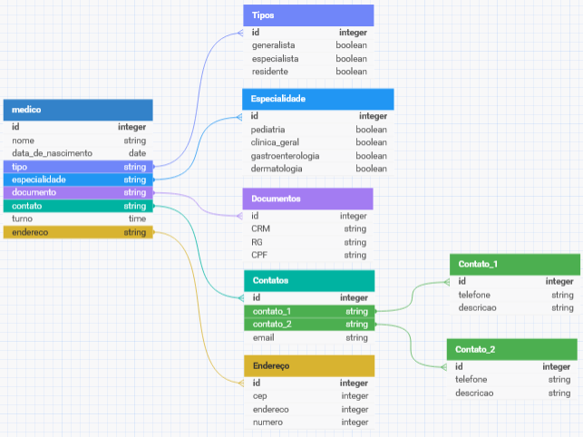
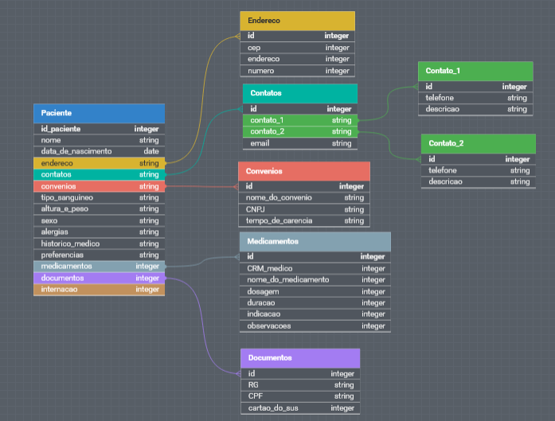
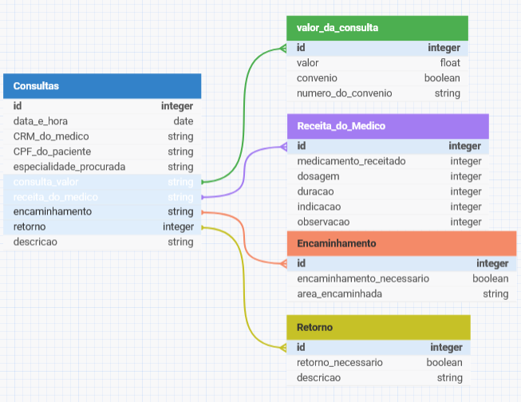
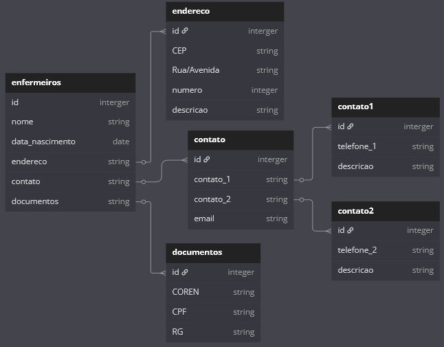

# Banco de Dados de um Hospital

# Parte 1 - Mãos a Obra 
  
Analise a seguinte descrição e extraia dela os requisitos para o banco de dados em um diagrama, fluxograma ou afins:
O hospital necessita de um sistema para sua área clínica que ajude a controlar consultas realizadas. Os médicos podem ser generalistas, especialistas ou residentes e têm seus dados pessoais cadastrados em planilhas digitais. Cada médico pode ter uma ou mais especialidades, que podem ser pediatria, clínica geral, gastroenterologia e dermatologia. Alguns registros antigos ainda estão em formulário de papel, mas será necessário incluir esses dados no novo sistema.



Os pacientes também precisam de cadastro, contendo dados pessoais (nome, data de nascimento, endereço, telefone e e-mail), documentos (CPF e RG) e convênio. Para cada convênio, são registrados nome, CNPJ e tempo de carência.



As consultas também têm sido registradas em planilhas, com data e hora de realização, médico responsável, paciente, valor da consulta ou nome do convênio, com o número da carteira. Também é necessário indicar na consulta qual a especialidade buscada pelo paciente.

Deseja-se ainda informatizar a receita do médico, de maneira que, no encerramento da consulta, ele possa registrar os medicamentos receitados, a quantidade e as instruções de uso. A partir disso, espera-se que o sistema imprima um relatório da receita ao paciente ou permita sua visualização via internet.



# Parte 2 - Não era exatamente assim 

Considere a seguinte descrição:

No hospital, as internações têm sido registradas por meio de formulários eletrônicos que gravam os dados em arquivos. 

Para cada internação, são anotadas a data de entrada, a data prevista de alta e a data efetiva de alta, além da descrição textual dos procedimentos a serem realizados. 

**Obs: colocadas junto com paciente, com a caracteristica em boolean se esta internado ou não**

As internações precisam ser vinculadas a quartos, com a numeração e o tipo. 

Cada tipo de quarto tem sua descrição e o seu valor diário (a princípio, o hospital trabalha com apartamentos, quartos duplos e enfermaria).


Também é necessário controlar quais profissionais de enfermaria estarão responsáveis por acompanhar o paciente durante sua internação. Para cada enfermeiro(a), é necessário nome, CPF e registro no conselho de enfermagem (COREN).
A internação, obviamente, é vinculada a um paciente – que pode se internar mais de uma vez no hospital – e a um único médico responsável.



# Parte 3  - Jogando nas regras que você criou:  
Crie scripts de povoamento dos documentos desenvolvidas na atividade anterior
Observe as seguintes atividades: 

- 12 medicos, ao menos sete especialidades (considere a afirmação de que “entre as especialidades há pediatria, clínica geral, gastrenterologia e dermatologia”).
- 15 pacientes
- 20 consultas
- Relacione as internações com IDs de Médicos e Pacientes
- 7 internações (entre 01/01/2015 e 01/01/2022)
- 10 profissionais de enfermaria

Parte 4 - Inserido Dados 
Pensando no banco que já foi criado para o Projeto do Hospital, realize algumas alterações nas tabelas e nos dados usando comandos de atualização e exclusão:

Crie um script que adicione uma coluna “em_atividade” para os médicos, indicando se ele ainda está atuando no hospital ou não.

Query:

```js
db.medicos.updateMany( {}, { $set: em_atividade: true } )
```

Crie um script para atualizar ao menos dois médicos como inativos e os demais em atividade.

Query:

```js
db.medicos.updateMany( { nome_medico: { $in: [ "Dra. Mariana Souza", "Dr. Gustavo Carvalho" ] } }, { $set: { em_atividade: false } } )
```
# Parte 5 - Consultas para que te quero 

Crie um script e nele inclua consultas que retornem:

1. Todos os dados e o valor médio das consultas do ano de 2020 e das que foram feitas sob convênio:
Q:
```js
  db.consultas.aggregate([
  {
    $match: {
      "data_e_hora": {
        $gte: ISODate("2020-01-01T00:00:00Z"),
        $lte: ISODate("2020-12-31T23:59:59Z")
      }
    }
  },
  {
    $group: {
      _id: null,
      consultas: { $push: "$$ROOT" },
      media_valor: { $avg: "$consulta_valor.valor" }
    }
  },
  {
    $project: {
      _id: 0,
      consultas: 1,
      media_valor: 1
    }
  }
])
```
R: existem duas consultas apenas em 2020 e as duas não foram feitas sob convenio, o valor medio das duas consultas é de 200


Todos os dados das internações que tiveram data de alta maior que a data prevista para a alta:


Receituário completo da primeira consulta registrada com receituário associado.
Todos os dados da consulta de maior valor e também da de menor valor (ambas as consultas não foram realizadas sob convênio).
Todos os dados das internações em seus respectivos quartos, calculando o total da internação a partir do valor de diária do quarto e o número de dias entre a entrada e a alta.
Data, procedimento e número de quarto de internações em quartos do tipo “apartamento”.
Nome do paciente, data da consulta e especialidade de todas as consultas em que os pacientes eram menores de 18 anos na data da consulta e cuja especialidade não seja “pediatria”, ordenando por data de realização da consulta.
Nome do paciente, nome do médico, data da internação e procedimentos das internações realizadas por médicos da especialidade “gastroenterologia”, que tenham acontecido em “enfermaria”.
Os nomes dos médicos, seus CRMs e a quantidade de consultas que cada um realizou.
Todos os médicos que tenham "Gabriel" no nome. 
Os nomes, CORENs e número de internações de enfermeiros que participaram de mais de uma internação.
